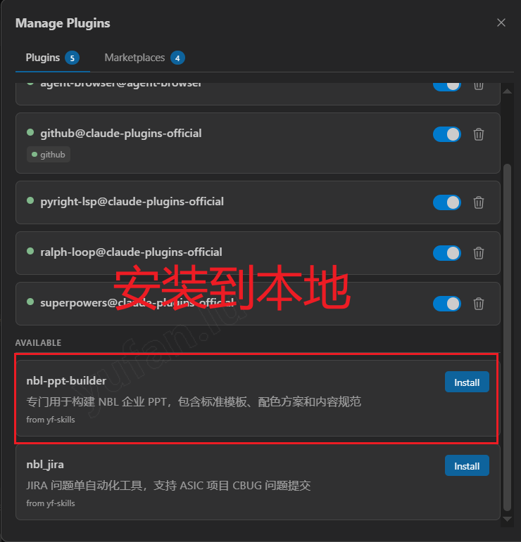
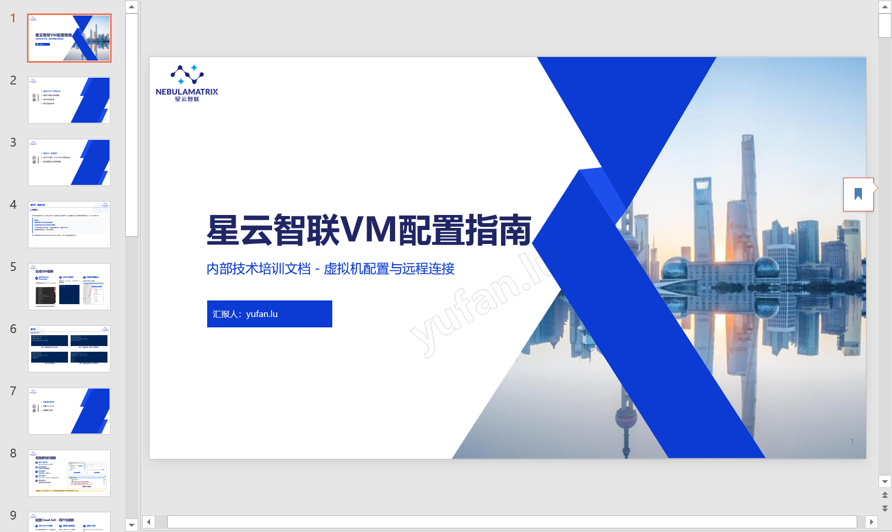
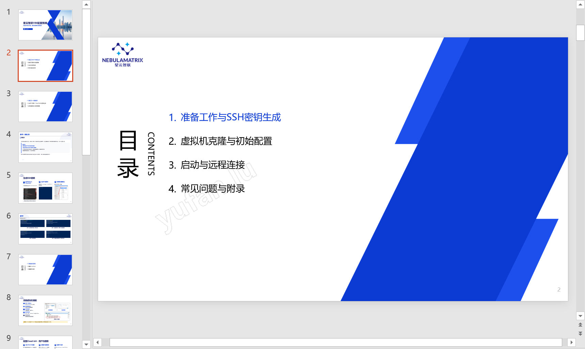
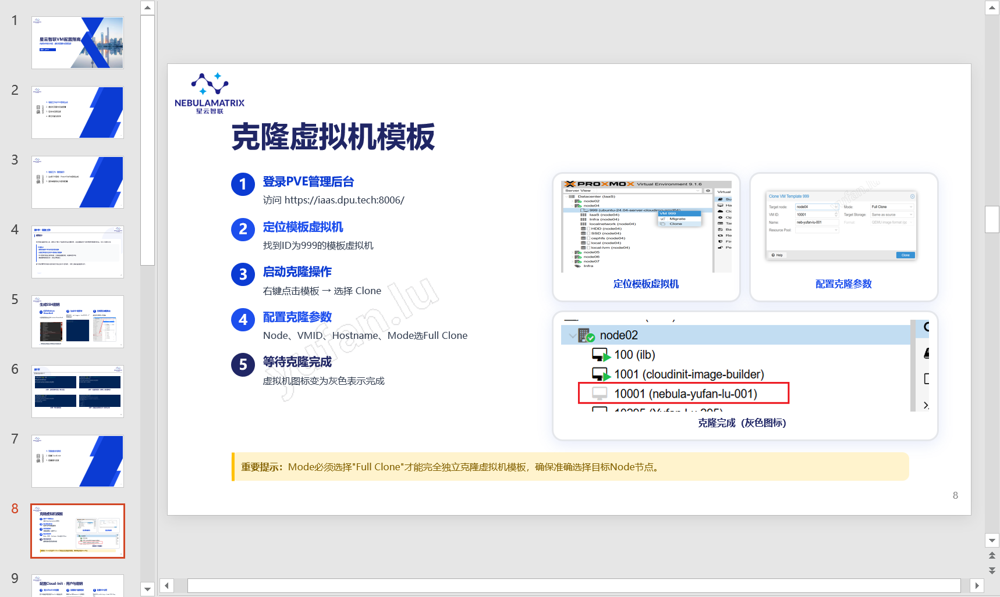
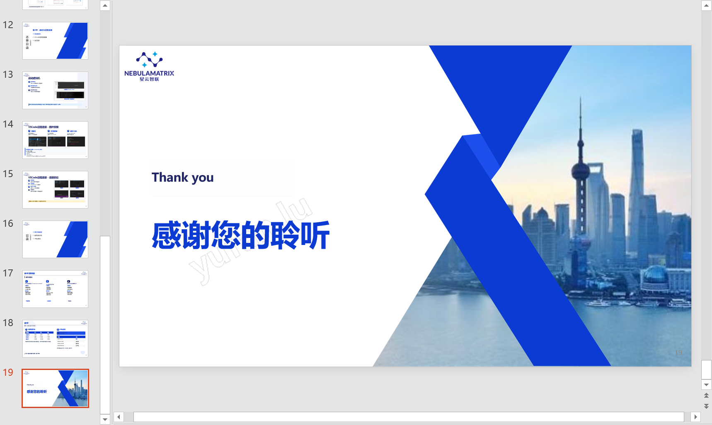

# NBL PPT Builder 使用指南

> 基于Claude Code的自动化PPT生成工具，通过AI智能选择模板并生成专业的企业演示文稿

---

## 📖 简介

NBL PPT Builder 是一个专门用于构建企业PPT的Claude Skill，集成基于Tailwind CSS的HTML模板库。它能自动分析内容、智能选择模板、生成专业级演示文稿。

**核心特性：**
- 🤖 AI驱动的模板智能选择
- 📊 14种专业模板（封面、目录、内容、结束页）
- 🎨 统一的企业配色方案（蓝色系）
- 🔄 5步构建流程，确保质量
- 📝 推荐使用Markdown文件作为输入材料

---

## 🗂️ 项目结构

```
nbl-ppt-builder/
├── .claude-plugin/
│   └── plugin.json          # 插件配置文件
├── skills/                   # Skill定义目录
├── templates/                # PPT模板目录（14个HTML模板）
│   ├── template_home.html    # 封面页
│   ├── template_toc.html     # 目录页
│   ├── template_end.html     # 结束页
│   └── template_content_*.html  # 各类内容页（11个）
└── scripts/                  # 辅助脚本
    └── merge_ppt_pages.py    # 页面合并脚本
```

**模板类型：**
- **基础页面**：封面、目录、结束页
- **内容模板**：
  - 单栏/双栏/三卡片布局
  - 流程图（4步/5步）
  - 数据图表（ECharts）
  - 图片展示（1-4张）

---

## 🚀 使用方法

### 安装方式

通过Claude Code的Skill机制安装后即可直接调用。



如图所示，可以通过插件市场添加到本地目录。

### 触发方式

安装完成后，可以通过以下两种方式触发：

**方式一：自然语言触发**

在对话中使用包含PPT相关意图的自然语言，例如：
- "使用NBL PPT技能帮我制作季度总结PPT"
- "帮我创建一个产品介绍的演示文稿"
- "制作幻灯片..."

**方式二：直接使用Skill命令（推荐）**

使用斜杠命令直接调用skill，更加精准高效：

```bash
/nbl-ppt-builder 帮我把 UEC-CC-Control.md 转换成PPT
```

> 💡 **提示**：使用skill命令方式可以直接指定输入文件，AI会自动读取并处理，效率更高

### 推荐输入材料

**💡 强烈推荐使用Markdown文件作为输入材料**

**优势：**
- ✅ 结构清晰，便于AI理解内容层次
- ✅ 格式统一，易于提取标题、列表、段落
- ✅ 支持代码块、表格等多种格式
- ✅ 可包含图片链接，便于资源引用

**示例：**

创建一个Markdown文件 `产品介绍.md`：

```markdown
# 新产品介绍PPT

## 基本信息
- 汇报人：张三
- 日期：2026年4月
- 目标受众：潜在客户

## 一、产品概述
本产品是一款创新的企业协作平台...

核心特点：
- 实时协作
- 多端同步
- 安全可靠

## 二、技术架构
采用微服务架构，包含以下模块：
1. 用户认证服务
2. 文件存储服务
3. 消息推送服务

## 三、使用场景

在线会议协作


文档实时编辑

## 四、市场数据
- 用户增长率：150%
- 日活跃用户：10万+
- 企业客户：500+
```

---

## 📋 构建流程

### 步骤1：信息收集

向用户提供基本信息：
- 汇报人姓名
- PPT主题/标题
- 汇报目的（内部汇报、对外介绍、培训等）
- 目标受众
- 输入材料（推荐Markdown文件）

**示例：**
```
用户：请帮我制作PPT，材料在产品介绍.md文件中

AI：收到！请确认以下信息：
1. 汇报人姓名：张三
2. PPT标题：新产品介绍
3. 汇报目的：客户展示
4. 目标受众：潜在客户
```

---

### 步骤2：材料分析与页面规划

AI分析Markdown内容，规划章节和页面：

```
AI：已分析您的材料，规划如下：

第1章：产品概述（3页）
- 封面页
- 目录页
- 产品介绍页

第2章：核心内容（5页）
- 技术架构页
- 使用场景展示（2页）
- 市场数据页

第3章：总结（2页）
- 总结页
- 结束页

共10页，是否符合要求？
```

---

### 步骤3：内容确认与迭代

查看规划大纲，确认或调整：

```
用户：可以增加一页竞品对比吗？

AI：好的，调整为11页：
第2章核心内容增加"竞品对比"页面...
```

---

### 步骤4：子代理生成内容

每个内容页由独立子代理生成：

**AI自动完成：**
- 分析页面内容类型
- 智能选择最合适的模板
- 替换模板占位符
- 生成完整HTML文件

**模板选择示例：**
- 产品介绍 → `template_content_single.html`
- 竞品对比 → `template_content_two_column.html`
- 使用场景（2图）→ `template_content_image_2.html`
- 市场数据 → `template_content_chart.html`

---

### 步骤5：模板检查与合并

最终检查并生成完整PPT：

```bash
# 合并所有页面
python scripts/merge_ppt_pages.py -d ppt_产品介绍/

# 输出：merged_presentation.html
```

**质量检查：**
- ✅ 至少使用5种不同模板
- ✅ 避免连续2页使用相同模板
- ✅ 合理利用图表、图片模板

---

## 💡 使用技巧

### 1. Markdown文件组织建议

```markdown
# 使用一级标题作为PPT标题

## 二级标题作为章节名

### 三级标题作为页面标题

- 列表项会转换为要点
- 图片链接会自动引用
- 代码块可用于技术内容
```

### 2. 图片资源准备

将图片放在同目录的 `images/` 文件夹：

```
产品介绍.md
images/
  ├── scene1.png
  ├── scene2.png
  └── logo.png
```

### 3. 页数控制建议

- 简介/概览：8-10页
- 标准汇报：12-15页
- 详细分析：16-20页

### 4. 内容密度建议

- 单栏页面：适合大段文字+要点
- 多栏页面：适合对比、并列内容
- 图片页面：每页1-4张图片
- 图表页面：数据可视化展示

---

## 🎯 完整示例

**输入文件：** [星云智联配置VM基础说明.md](../vm-configuration/星云智联配置VM基础说明.md)

该文档包含完整的虚拟机配置流程说明，结构清晰，包含多个章节和大量截图，非常适合作为PPT生成的输入材料。

**生成过程：**

```
用户：/nbl-ppt-builder 帮我把 星云智联配置VM基础说明.md 转换成PPT

AI：[步骤1] 确认信息：汇报人信息，标题"星云智联配置VM基础说明"...

AI：[步骤2] 规划结构：
第1章：准备工作（封面、目录）
第2章：核心流程（生成SSH密钥、克隆虚拟机、配置Cloud-Init、配置硬件）
第3章：使用与连接（启动虚拟机、VSCode远程连接）
第4章：问题排查（常见问题、结束页）
共12页

用户：可以

AI：[步骤4-5] 正在生成各页面...
- 01_home.html（封面页）
- 02_toc.html（目录页）
- 03_准备工作.html（单栏模板）
- 04_生成SSH密钥.html（流程图模板）
- 05_克隆虚拟机模板.html（图片展示模板）
- 06_配置Cloud-Init.html（多步骤模板）
...
AI：已完成！生成了12页PPT，使用了7种模板

输出：merged_presentation.html
```

---

## 📸 最终效果展示

以下展示基于 [星云智联配置VM基础说明.md](../vm-configuration/星云智联配置VM基础说明.md) 生成的PPT效果：

### 封面页



展示PPT标题、汇报人信息和日期，采用企业标准配色和背景图。

### 目录页



清晰展示文档的主要章节结构，帮助观众快速了解内容框架。

### 内容页



内容页面自动选择合适的模板，展示具体配置步骤和说明文字。

### 结束页



统一的结束页面，感谢观看，保持专业形象。


---

## 🔧 常见问题

### Q1：为什么推荐Markdown文件？

**A：** Markdown文件结构清晰，易于AI理解：
- 标题层级对应PPT章节
- 列表自动转换为要点
- 图片链接易于引用
- 格式统一，减少歧义

### Q2：如何自定义模板样式？

**A：** 模板基于Tailwind CSS，可修改：
- `templates/*.html` 文件中的样式类
- 调整配色方案（搜索颜色代码）
- 修改布局参数

### Q3：生成后如何查看？

**A：** 直接在浏览器中打开 `merged_presentation.html`：
- 支持全屏展示
- 可打印为PDF
- 可截图分享

### Q4：可以添加动画效果吗？

**A：** 当前模板专注于静态展示，动画需要手动添加CSS动画类。

---

## 📚 扩展阅读

- [模板详细说明](https://github.com/luyufan498/yf-skills/tree/main/nbl-ppt-builder)
- [Tailwind CSS文档](https://tailwindcss.com/)
- [ECharts图表配置](https://echarts.apache.org/)

---

**文档版本**：v1.0
**最后更新**：2026年4月
**维护者**：星云智联技术团队
