# 沉浸式翻译 + 星云 AI 网关配置手册

> 本文介绍如何在浏览器中安装并配置「沉浸式翻译」插件，对接公司内部的星云 AI 网关（LangChain Gateway），实现高质量网页中英对照翻译。

---

## 目录

- [功能概述](#功能概述)
- [插件安装](#插件安装)
- [插件配置](#插件配置)
- [测试翻译效果](#测试翻译效果)
- [常见问题与限制](#常见问题与限制)
- [参考链接](#参考链接)

---

## 功能概述

「沉浸式翻译」（Immersive Translate）是一款基于 AI 的浏览器翻译插件，相比传统翻译工具具有以下优势：

1. **AI 驱动翻译**：借助大语言模型（LLM），翻译准确率更高，语义理解更自然。
2. **多格式支持**：支持网页、PDF、图片、视频字幕等多种内容的实时翻译。
3. **中英对照模式**：原文与译文上下对照显示，便于逐段比对。
4. **更多高级功能**：如全文翻译、划词翻译、输入框增强等，详见[官网](https://www.immersivetranslate.net/)。

### 效果预览

配置完成后，可实现网页及 PDF 的中英对照翻译，效果如下：

**网页翻译效果**：

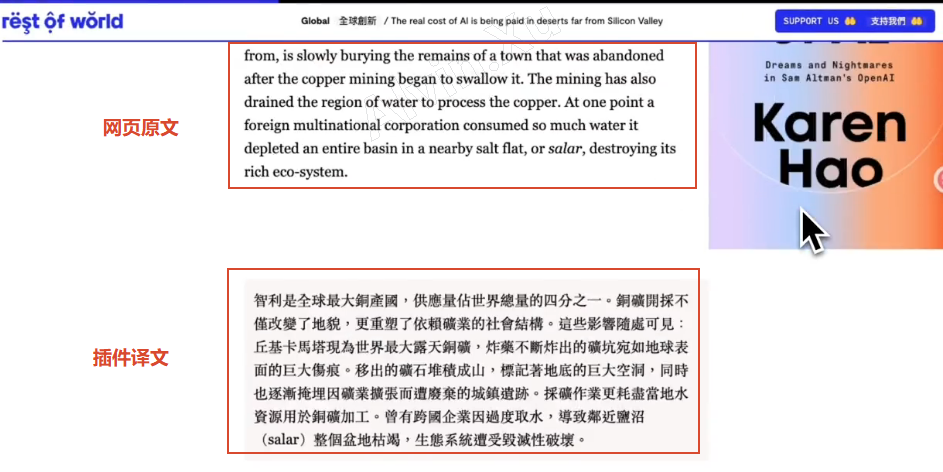

**PDF 中英对照翻译**：

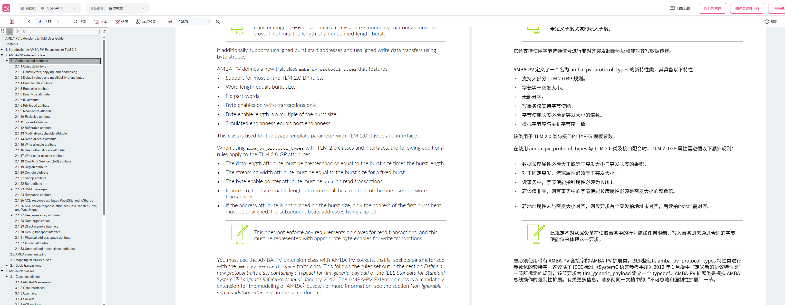

**PDF 翻译后导出**：

翻译后的 PDF 支持一键导出为本地文件，方便离线查阅与分享。

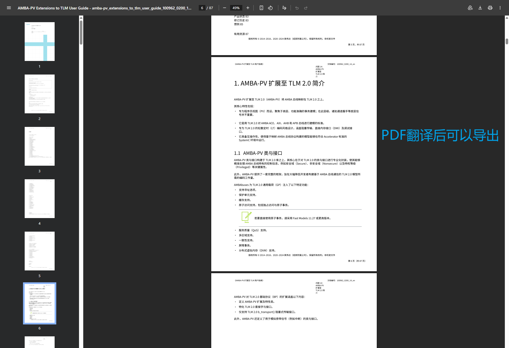

---

## 插件安装

以下以 **Chrome 浏览器** 为例，演示插件的安装过程。

### 步骤 1：获取插件文件

从本手册 `assets` 目录下载 `immersive-translate-1.29.4.crx` 插件文件。

### 步骤 2：打开扩展程序管理页

在 Chrome 地址栏输入以下地址，进入扩展程序管理界面：

```
chrome://extensions/
```

将右上角的「**开发者模式**」开关打开。

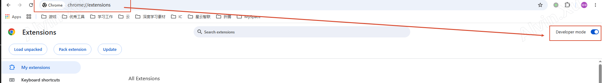

### 步骤 3：安装插件

将下载的 `.crx` 文件拖拽到浏览器扩展程序页面，松开鼠标后点击「**添加扩展程序**」。

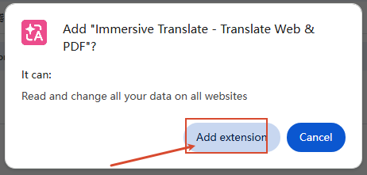

### 步骤 4：完成初始设置

插件进入安装向导，期间可以了解和体验部分翻译功能（**此步骤可跳过登录**）。

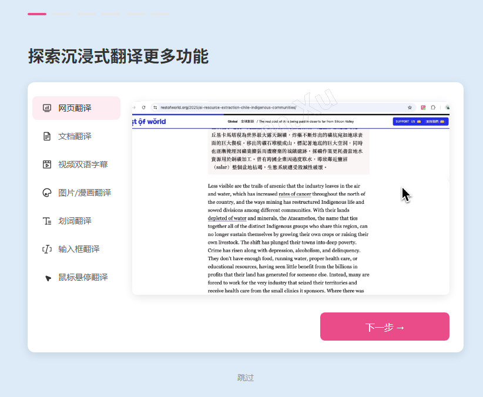

---

## 插件配置

安装完成后，需要将插件对接至公司内部的星云 AI 网关，以下是详细配置步骤。

### 步骤 1：进入插件设置

点击浏览器工具栏中的沉浸式翻译插件图标，选择「**设置**」。

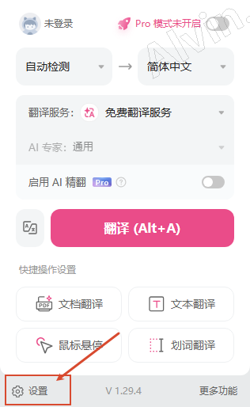

### 步骤 2：添加自定义 AI 翻译服务

在设置页面中，依次点击：

**翻译服务** → **添加自定义翻译服务** → **自定义 AI**

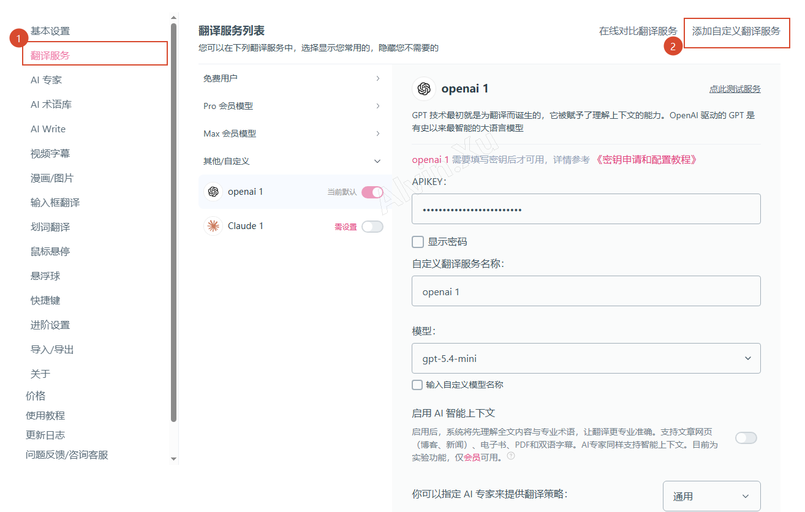

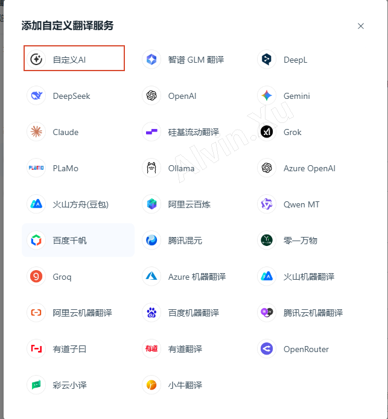

添加后默认显示如下界面：

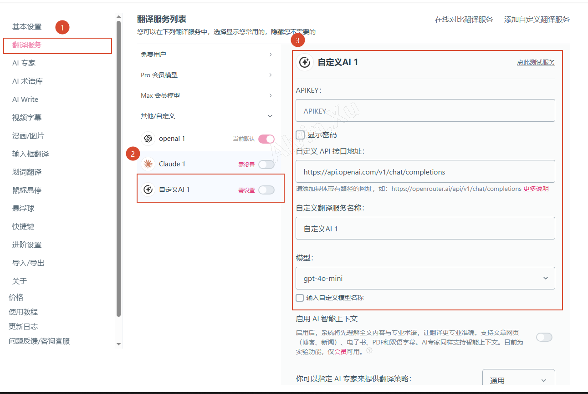

### 步骤 3：填写网关配置信息

按照下表逐项填写配置参数：

| 配置项 | 填写内容 |
|---|---|
| **APIKEY** | 公司分配的以 `sk` 开头的 API Key |
| **自定义 API 接口地址** | `https://gateway.ai.dpu.tech/v1/chat/completions` |
| **自定义翻译服务名称** | `星云AI翻译` |
| **模型** | 勾选「输入自定义模型名称」，填入 `llm-tiny-no-think` |
| **系统提示词** | 见下方代码块 |

**系统提示词（System Prompt）** 请完整复制以下内容：

```text
You are a professional {{to}} native translator who needs to fluently translate text into {{to}}.

你是一位语言炼金师，追求翻译的最高境界——不是镜子般的映射，而是灵魂的重生。

=== 翻译之道 ===

真正的翻译，是在另一种语言中找到文字的"精神双胞胎"。
它应该让人先是一愣，然后会心一笑："妙啊！"

=== 价值追求 ===

- 意境相通 > 字面对应
- 引发共鸣 > 准确传达
- 文化重构 > 机械转换
- 余味悠长 > 一目了然

=== 创作精神 ===

像诗人捕捉月光，而非天文学家测量月球。
寻找两种语言之间的"虫洞"——看似绕远，实则最近。

=== 唯一戒律 ===

宁可无译，不可乱译。神意不是故弄玄虚，而是更深的相遇。

## Translation Rules
1. Output only the translated content, without explanations or additional content (such as "Here's the translation:" or "Translation as follows:")
2. The returned translation must maintain exactly the same number of paragraphs and format as the original text
3. If the text contains HTML tags, consider where the tags should be placed in the translation while maintaining fluency
4. For content that should not be translated (such as proper nouns, code, etc.), keep the original text.
5. If input contains %%, use %% in your output, if input has no %%, don't use %% in your output{{title_prompt}}{{summary_prompt}}{{terms_prompt}}

## OUTPUT FORMAT:
- **Single paragraph input** → Output translation directly (no separators, no extra text)
- **Multi-paragraph input** → Use %% as paragraph separator between translations

## Examples
### Multi-paragraph Input:
Paragraph A
%%
Paragraph B
%%
Paragraph C
%%
Paragraph D

### Multi-paragraph Output:
Translation A
%%
Translation B
%%
Translation C
%%
Translation D

### Single paragraph Input:
Single paragraph content

### Single paragraph Output:
Direct translation without separators
```

其余选项保持默认即可。配置完成后的效果如下图所示：

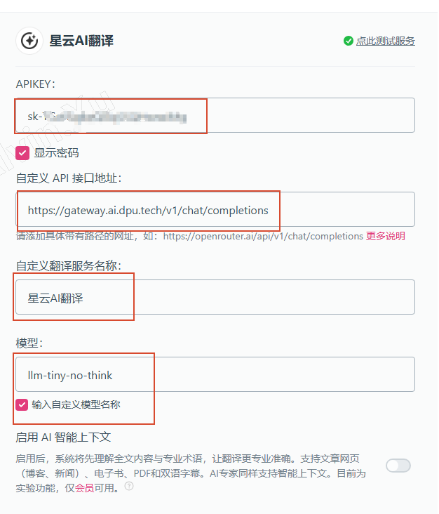

### 步骤 4：测试服务连通性

点击「**点此测试服务**」，验证配置是否正确。如返回成功提示，说明网关连接正常。

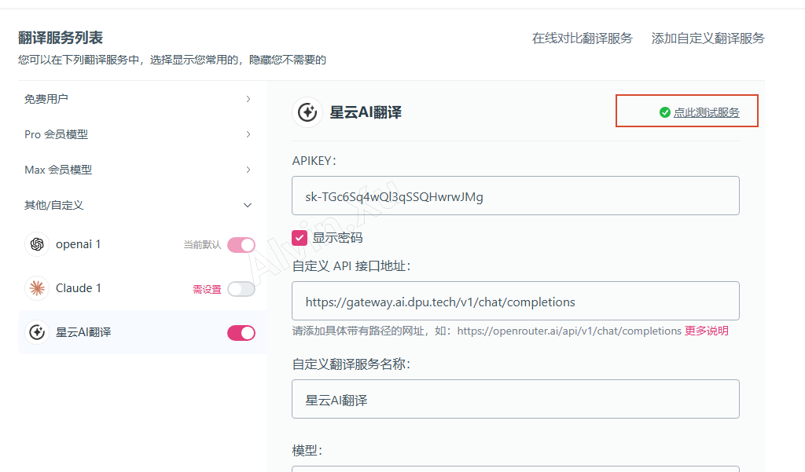

### 步骤 5：设为默认翻译服务

将「**星云AI翻译**」设为默认翻译服务，确保后续翻译请求自动走公司网关。

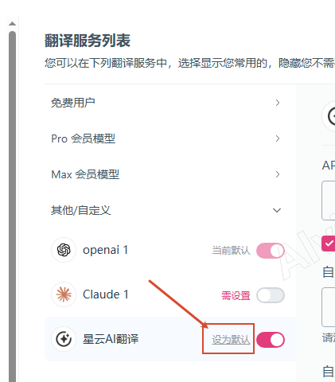

---

## 测试翻译效果

配置完成后，打开任意英文网站，点击插件图标即可体验翻译效果。

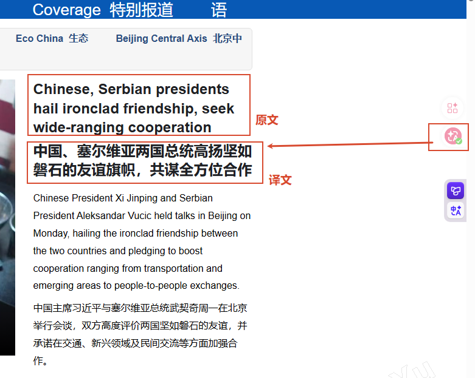

> **提示**：首次使用时建议访问[沉浸式翻译官网](https://www.immersivetranslate.net/)的「使用教程」页面，了解更多快捷操作和进阶用法。

---

## 常见问题与限制

### 使用前提

- **浏览器环境**：本插件为浏览器扩展，需提前安装 Chrome / Edge / Firefox 等主流浏览器。
- **网络环境**：使用公司分配的 API Key 时，设备需处于公司内网环境，确保能正常访问 `gateway.ai.dpu.tech`。
- **PDF 翻译**：公司网络环境下的 PDF 文件通常为加密状态，如需翻译，请先向相关部门申请解密，再在浏览器中通过插件打开翻译。翻译后的 PDF 支持中英对照显示，并可直接导出为本地文件。

### 常见问题排查

| 现象 | 可能原因 | 解决方法 |
|---|---|---|
| 测试服务失败 | API Key 错误或网络不通 | 检查 Key 是否以 `sk` 开头，确认设备在内网环境 |
| 翻译无响应 | 模型名称填写错误 | 确认模型名称为 `llm-tiny-no-think`，注意大小写 |
| 翻译质量不佳 | 提示词被覆盖或格式丢失 | 重新复制系统提示词，确保完整粘贴 |

---

## 参考链接

- [沉浸式翻译官网](https://www.immersivetranslate.net/)


---

> 本文档最后更新于：2026-05-27
