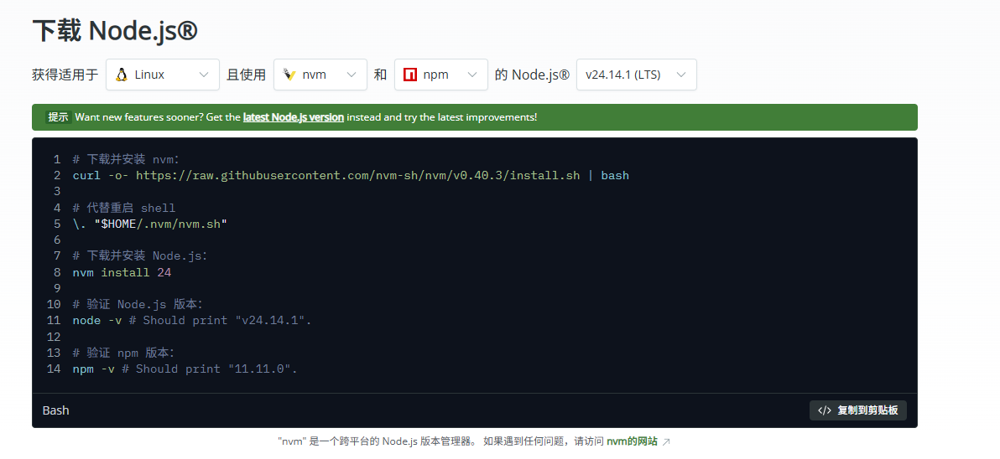

# Node.js 环境安装指南

> 本文档指导如何在 Linux 环境下安装 Node.js 运行环境。Node.js 是许多 AI 工具和插件（包括 Claude Code）的重要依赖环境。

---

## 目录

1. [安装说明](#安装说明)
2. [下载安装脚本](#下载安装脚本)
3. [安装 Node.js](#安装-nodejs)
4. [验证安装](#验证安装)

---

## 安装说明

Claude Code 以及众多 AI 生态工具和插件都需要依赖 Node.js 环境。推荐使用 **nvm (Node Version Manager)** 进行安装，方便管理多个 Node.js 版本。

### 系统要求

- 操作系统：Linux
- 工具：nvm + npm

---

## 下载安装脚本

### 步骤 1：访问官网下载页面

打开 Node.js 官方下载页面：

**https://nodejs.org/zh-cn/download**



### 步骤 2：选择安装参数

在下载页面选择以下参数：

- **适用于平台**：Linux
- **使用工具**：nvm 和 npm
- **版本选择**：Node.js v24.14.1 (LTS) - 长期支持版本

---

## 安装 Node.js

官网推荐执行以下命令完成安装：

```bash
# 下载并安装 nvm
curl -o- https://raw.githubusercontent.com/nvm-sh/nvm/v0.40.3/install.sh | bash

# 代替重启 shell
\. "$HOME/.nvm/nvm.sh"

# 下载并安装 Node.js
nvm install 24

# 验证 Node.js 版本
node -v  # 应显示 "v24.14.1"

# 验证 npm 版本
npm -v   # 应显示 "11.11.0"
```

按照以上步骤依次执行即可完成安装。

---

## 验证安装

安装完成后，执行以下命令验证安装是否成功：

```bash
# 检查 Node.js 版本
node -v

# 检查 npm 版本
npm -v
```

如果显示正确的版本号，说明安装成功。

---

## 常见问题

### nvm 命令找不到

如果在执行 `nvm` 命令时提示找不到命令，请尝试：

1. 重启终端
2. 或手动加载 nvm：`\. "$HOME/.nvm/nvm.sh"`

### 安装速度慢

如果从官方源下载速度较慢，可以考虑配置国内镜像源加速下载。

---

## 相关链接

- [Node.js 官网](https://nodejs.org/)
- [nvm GitHub 仓库](https://github.com/nvm-sh/nvm)