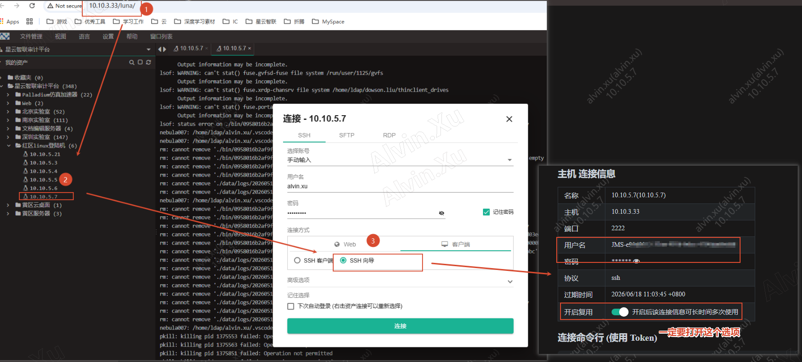
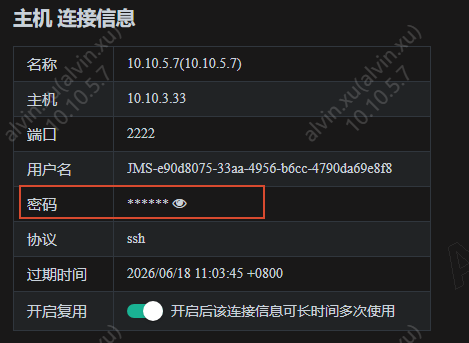
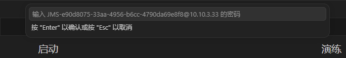
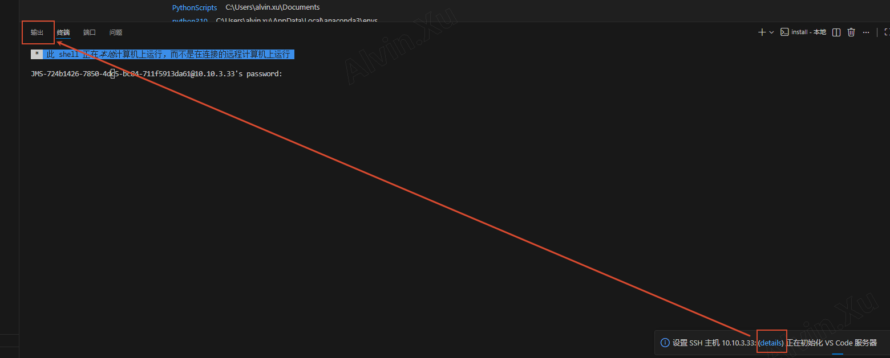
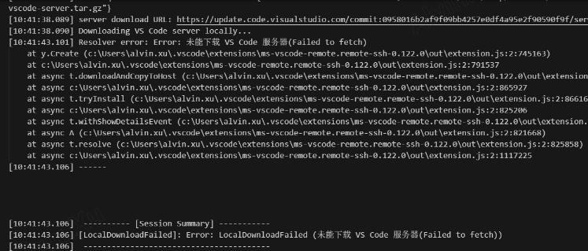

# VS Code 通过 JMS 堡垒机连接远程服务器

本文档介绍如何在 Windows 环境下，使用 VS Code 的 Remote-SSH 插件，通过 JMS（Jump Server，堡垒机）连接内网远程服务器进行开发。

---

## 目录

- [前置准备](#前置准备)
- [Windows 环境配置](#windows-环境配置)
- [VS Code 配置](#vs-code-配置)
- [常见问题排查](#常见问题排查)

---

## 前置准备

### 所需文件

- [scp.exe](assets/scp.exe) — 用于替换系统默认的 SCP 传输工具

> **提示**：请将上述文件下载到本地备用。

---

## Windows 环境配置

1. **创建 SSH 工具目录**

   在 `C` 盘根目录下新建名为 `ssh` 的文件夹：

   ```
   C:\ssh\
   ```

2. **复制系统 OpenSSH 文件**

   将 Windows 系统自带的 OpenSSH 客户端文件全部复制到上一步创建的 `C:\ssh\` 目录中。源文件位置：

   ```
   C:\Windows\System32\OpenSSH\
   ```

3. **替换 SCP 可执行文件**

   将前置准备中下载的 `scp.exe` 复制到 `C:\ssh\` 目录，**覆盖**同名文件。

---

## VS Code 配置

### 1. 获取主机连接信息

在配置 VS Code 之前，需先通过 JMS SSH 向导获取连接所需的用户名和密钥：

1. 通过内网访问 JMS 堡垒机：`10.10.3.33`。
2. 登录 `10.10.5.7` 的 SSH 向导。
3. 记录下向导提供的 **用户名** 和 **密码**（后续配置 SSH 和连接时需要用到）。

> **注意**：务必将**开启复用**开启，避免每次登录时用户名和密码重新随机。

向导页面如下图所示：



### 2. 配置 SSH Remote 连接

打开 VS Code，按 `Ctrl + Shift + P`，输入并选择 **Remote-SSH: Open SSH Configuration File**，编辑配置文件，添加如下主机条目：

```ssh
Host 10.10.3.33
  HostName 10.10.3.33
  User <ssh向导获取的用户名>
  Port 2222
  ForwardAgent no
```

配置项说明：

| 配置项 | 说明 |
|--------|------|
| `Host` | 连接别名，在 VS Code Remote-SSH 菜单中显示的名称 |
| `HostName` | JMS 堡垒机的实际 IP 地址 |
| `User` | **【必填】** SSH 登录用户名，需通过 JMS SSH 向导获取 |
| `Port` | JMS 堡垒机的 SSH 服务端口，默认为 `2222` |
| `ForwardAgent` | 禁用 SSH 代理转发，避免密钥泄露风险 |

### 3. 修改 VS Code 用户设置

按 `Ctrl + Shift + P`，输入并选择 **首选项: 打开用户设置 (JSON)**，在配置文件中新增以下内容：

> **注意**：配置中的 `10.10.3.33` 应与第 2 步中 SSH Remote 配置里的 `Host` 保持一致。

```json
{
  "remote.SSH.path": "C:\\ssh\\ssh.exe",
  "remote.SSH.useExecServer": false,
  "remote.SSH.remotePlatform": {
    "10.10.3.33": "linux"
  }
}
```

### 4. 处理 `.cshrc` 终端输出干扰（如需要）

如果远程服务器使用 C Shell（`csh`/`tcsh`）且家目录下存在 `.cshrc` 文件，建议在首次连接前检查并处理，否则 VS Code 可能卡在服务器复制阶段：

> **原因**：终端自动加载 `.cshrc` 时，如果其中包含向终端输出的操作（例如 `OS: ubuntu (skipping CentOS configs)`），这些输出会干扰 VS Code 对连接状态的判断，从而导致复制操作失败。

**操作步骤**：

1. 通过其他方式（如 Xshell、PuTTY）先登录到远程服务器。
2. 备份并临时注释家目录下的 `.cshrc`：

   ```bash
   cp ~/.cshrc ~/.cshrc.bak
   sed -i 's/^/# /' ~/.cshrc
   ```

3. 完成 VS Code 连接后，可根据需要恢复备份：

   ```bash
   mv ~/.cshrc.bak ~/.cshrc
   ```

> **潜在影响**：CentOS 开发环境可能依赖 `.cshrc` 中的配置，全部注释后可能影响正常使用。建议仅在首次建立连接时临时操作，完成后恢复原配置。

### 5. 发起连接

1. 按 `Ctrl + Shift + P`，选择 **Remote-SSH: Connect to Host...**，选择 `10.10.3.33`。
2. 当提示输入密码时，填入从 JMS SSH 向导获取的密码，如下图所示。



3. 等待连接建立，即可在远程服务器上打开文件夹进行开发。

> **注意**：连接过程中可能多次要求输入密码，如下图所示：


---

## 常见问题排查

### 如何查看连接日志

如果连接失败，可通过以下步骤查看详细日志：

1. 在 VS Code 右下角点击连接状态提示。
2. 打开 **输出** 面板（`Ctrl + Shift + U`）。
3. 在右上角下拉菜单中选择 **Remote-SSH**。
4. 根据日志中的错误信息进行排查。



### 错误：LocalDownloadFailed

**现象**：



**解决方案**：

- 检查并关闭本地代理。
- 重新尝试连接。

---
