# 星云智联配置VM基础说明

> 本手册指导用户如何在星云智联平台上配置虚拟机（VM）并通过 SSH 进行远程连接。

---

## 目录

1. [准备工作](#准备工作)
2. [生成SSH密钥](#生成ssh密钥)
3. [克隆虚拟机模板](#克隆虚拟机模板)
4. [配置Cloud-Init](#配置cloud-init)
5. [配置硬件资源](#配置硬件资源)
6. [启动虚拟机](#启动虚拟机)
7. [VSCode远程连接](#vscode远程连接)

---

## 准备工作

### 重要提示

⚠️ **集群部署的VM不允许使用密码登录**，用户必须在本地自行生成SSH密钥后才能登录。

---

## 生成SSH密钥

### 步骤1：打开Windows PowerShell

在Windows开始菜单栏中，右键点击，选择"以管理员身份运行"打开 **Windows PowerShell**。

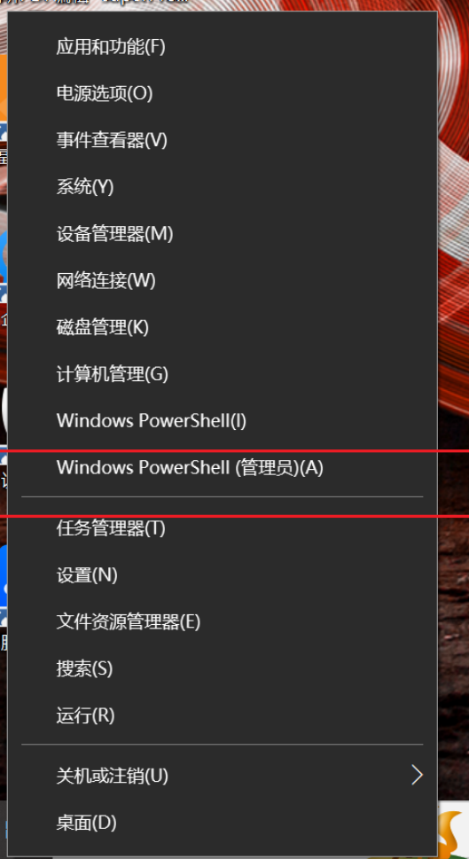

---

### 步骤2：生成SSH密钥对

在PowerShell命令行中输入以下命令：

```bash
ssh-keygen -t ed25519 -C "<替换成星云的邮箱地址>"
```

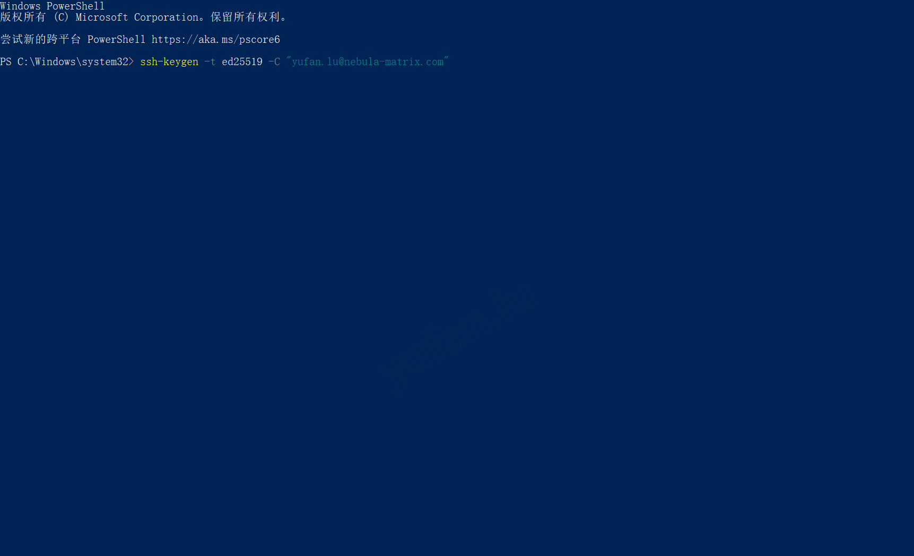

**参数说明：**
- `-t ed25519`：使用Ed25519算法生成密钥（比RSA更安全、更快速）
- `-C`：添加注释，通常使用邮箱地址

---

### 步骤3：查找星云邮箱地址

邮箱地址需要在钉钉中查找：

1. 打开钉钉应用
2. 点击"邮箱"入口
3. 左侧最上方即可看到邮箱地址

一般情况下，邮箱格式为：`<账户名>@nebula-matrix.com`

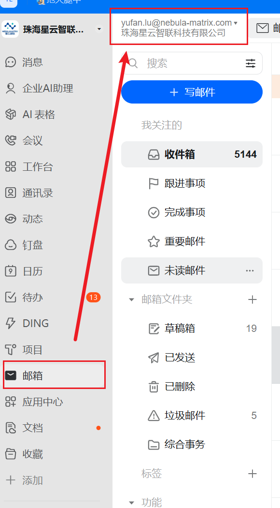

---

### 步骤4：选择密钥保存路径

回车后，系统会提示输入密钥文件的保存路径。

> **建议**：直接按回车键，选择默认路径（通常是 `C:\Users\<用户名>\.ssh\id_ed25519`）

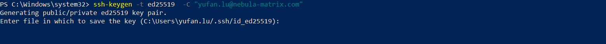

---

### 步骤5：设置密钥密码

系统会提示设置密钥的访问密码（**此为必填项**），用于保护私钥文件的安全。

> ⚠️ **重要**：必须设置一个强密码，并妥善保管。此密码将在后续连接时使用。

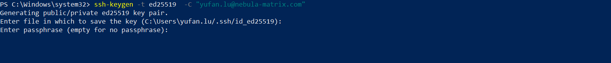

---

### 步骤6：确认密钥密码

再次输入相同的密码进行确认。

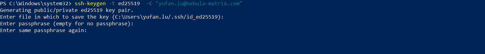

---

### 步骤7：查看生成的密钥文件

密钥生成完成后，会显示保存路径。其中：

- **`id_ed25519`**：私钥文件（**请勿外泄**）
- **`id_ed25519.pub`**：公钥文件（**需要提供给虚拟机**）

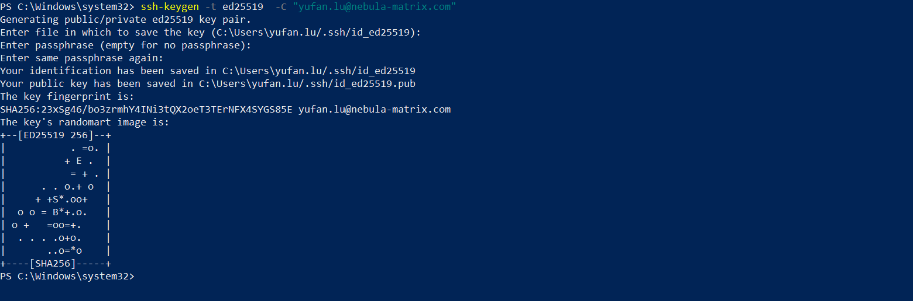

---

## 克隆虚拟机模板

### 步骤1：登录PVE管理后台

使用浏览器访问：`https://iaas.dpu.tech:8006/`

登录成功后，左侧面板将显示虚拟机等相关资源列表。

---

### 步骤2：定位模板虚拟机

在资源列表中找到 **ID为999**的虚拟机模板（这是星云智联的基础镜像模板）。

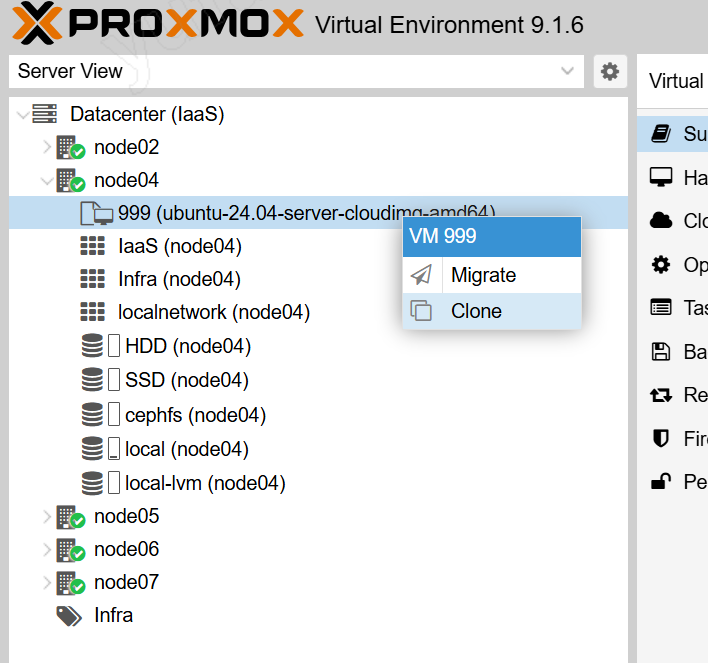

---

### 步骤3：启动克隆操作

1. 右键点击ID为999的模板虚拟机
2. 在弹出菜单中选择 **Clone（克隆）** 选项

---

### 步骤4：配置克隆参数

在弹出的克隆窗口中填写以下信息：

| 参数项 | 说明 | 注意事项 |
|--------|------|----------|
| **Node** | 选择虚拟机部署的节点 | 需根据资源调度表选择可用节点 |
| **VMID** | 虚拟机唯一标识符 | 格式待定（TBD） |
| **Hostname** | 虚拟机主机名 | 建议使用有意义的名称（如：dev-svr-01） |
| **Mode** | 克隆模式 | **必须选择"Full Clone"** |

> ⚠️ **重要**：Mode必须修改为 **Full Clone**，否则虚拟机将是模板的链接而非独立实例。

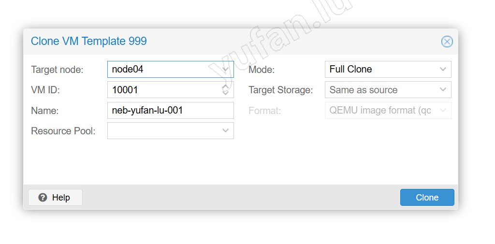

---

### 步骤5：等待克隆完成

点击"Clone"后：

1. 资源池中将新增一个虚拟机
2. 新虚拟机会处于 **Locked（锁定）** 状态
3. 需要等待一段时间，让服务器完成克隆和数据转移

克隆完成后，对应的Node节点下会出现一个**灰色图标**的虚拟机，表示虚拟机尚未启动，此时可以开始配置。

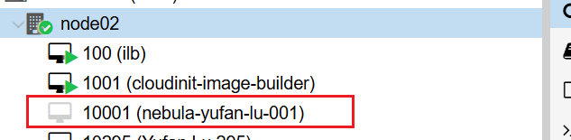

---

## 配置Cloud-Init

Cloud-Init是云环境下自动配置虚拟机的工具，用于首次启动时初始化系统。

### 步骤1：进入Cloud-Init配置页面

1. 点击新克隆的虚拟机
2. 在右侧菜单中选择 **Cloud-Init** 选项卡

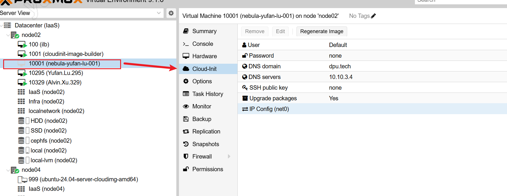

---

### 步骤2：配置用户名和密码

在Cloud-Init配置页面中配置：

- **User**：设置虚拟机的管理员用户名（如：`nebuser`）
- **Password**：设置用户密码（用于SSH密码登录）

> ⚠️ **注意**：此处的用户名和密码必须配置，否则后续SSH无法登录。

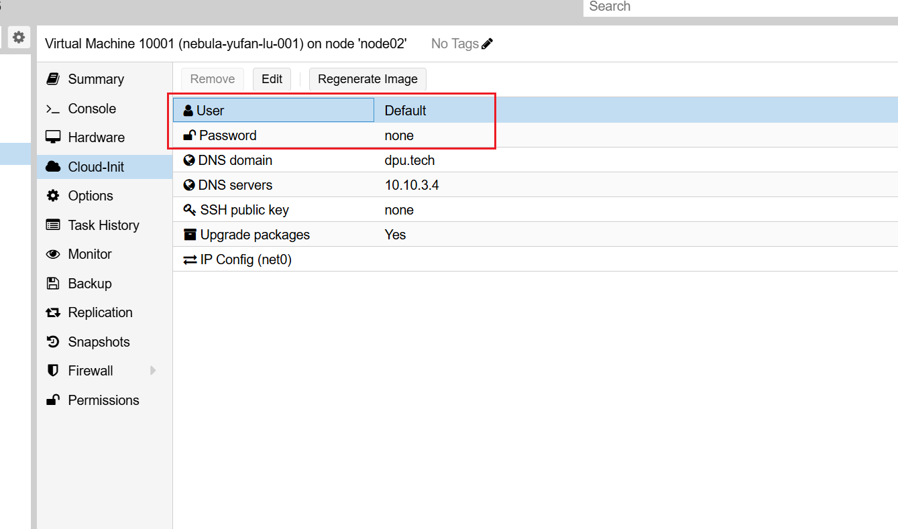

---

### 步骤3：配置SSH公钥

#### 3.1 找到SSH公钥配置项

在Cloud-Init配置选项中找到 **SSH public key** 这一行（当前状态可能显示为 `none`），**双击**该区域。

#### 3.2 加载公钥文件

双击后会弹出 **Edit: SSH Keys** 窗口：

1. 点击左下角的蓝色按钮 **Load SSH Key File**
2. 从本地计算机中选择之前生成的公钥文件（`id_ed25519.pub`）

#### 3.3 确认并保存

成功加载后，你的公钥内容（以 `ssh-ed25519...` 开头的字符）会显示在文本框中。确认无误后，点击 **OK** 按钮保存。

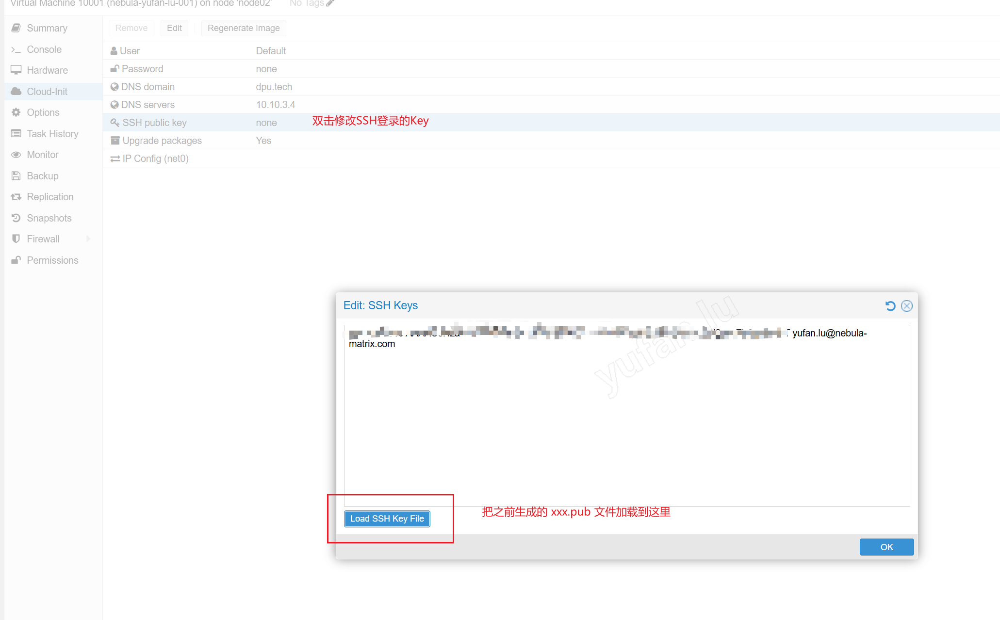

---

### 步骤4：配置静态IP地址

#### 4.1 进入网络配置

在Cloud-Init设置界面中，找到 **IP Config (net0)** 这一行，**双击**打开网络配置窗口。

#### 4.2 设置静态IPv4地址

在弹出的 **Edit: Network Config** 窗口中：

1. 选择 **IPv4** 部分的 **Static**（静态）单选按钮
2. 在 **IPv4/CIDR** 输入框中填写静态IP地址，格式为 `10.10.110.xxxx/24`
   - 例如：`10.10.110.101/24`
3. 在 **Gateway (IPv4)** 输入框中填写网关地址：`10.10.110.1`

> ⚠️ **注意**：IP地址需要根据可用IP分配表选择，避免与其他虚拟机冲突。

#### 4.3 保存配置

确认IP地址和网关地址无误后，点击 **OK** 按钮保存网络配置。

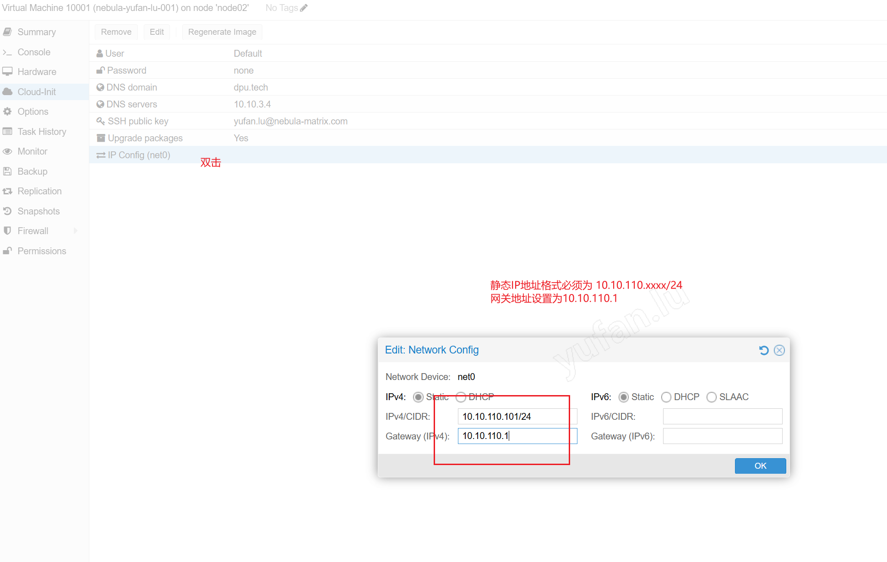

---

### 步骤5：重新生成镜像

> ⚠️ **关键步骤**：所有Cloud-Init配置完成后，必须点击 **Regenerate Image** 按钮，使配置生效。

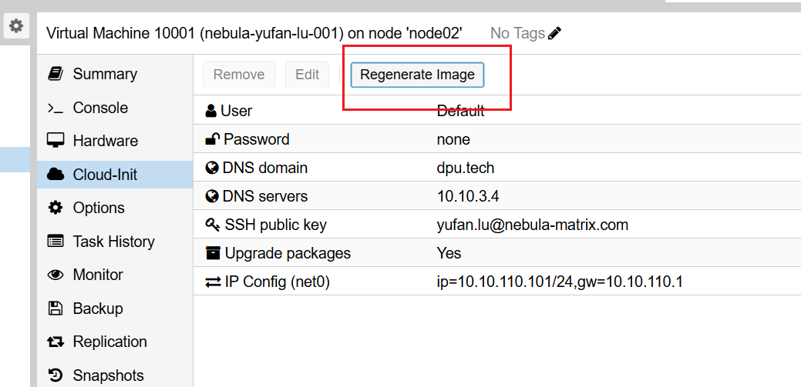

---

## 配置硬件资源

点击 **Hardware** 选项，进入虚拟机硬件配置页面。

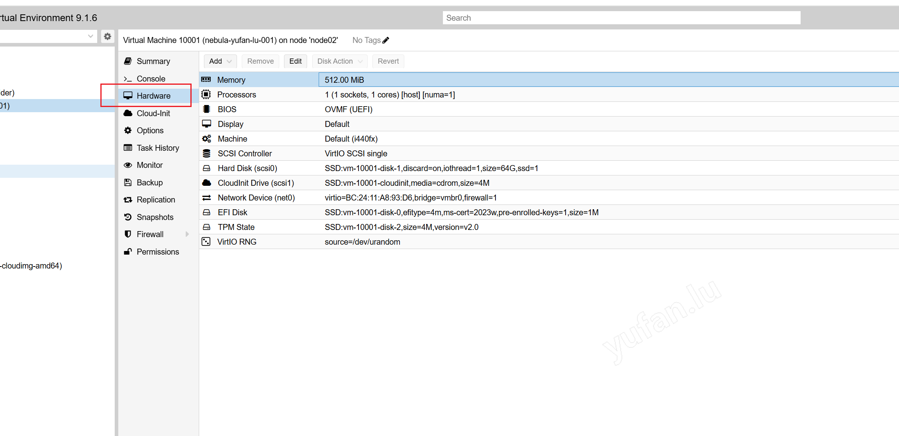

---

### 步骤1：调整内存大小

#### 1.1 找到内存配置项

在硬件列表中找到 **Memory**（内存）这一行。

- 图中显示当前内存为 `512.00 MiB`
- 双击这一行，或选中后点击上方的 **Edit** 按钮

#### 1.2 修改内存数值

在弹出的 **Edit: Memory** 对话框中：

1. 找到 **Memory (MiB)** 输入框
2. 根据实际需求输入内存大小（单位：MiB）
   - 例如：`16384`（即16GB）

#### 1.3 保存更改

确认数值无误后，点击 **OK** 按钮保存。

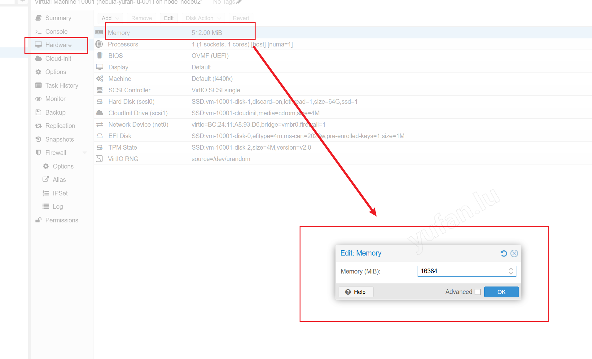

---

### 步骤2：配置CPU核心数

#### 2.1 找到处理器配置项

在硬件列表中找到 **Processors** 这一行。

- 图中显示当前配置是 `1 (1 sockets, 1 cores)`，表示仅1个核心

#### 2.2 打开编辑窗口

双击 **Processors** 这一行，或选中后点击 **Edit** 按钮，弹出 **Edit: Processors** 对话框。

#### 2.3 调整核心参数

在对话框中配置以下参数：

| 参数 | 说明 | 推荐值 |
|------|------|--------|
| **Sockets** | 虚拟插槽数 | 保持 `1` |
| **Cores** | 每插槽的核心数 | 根据需求设置（如：`8`） |
| **Type** | CPU类型 | 保持默认 `host` |

系统会自动计算 **Total cores**（总核心数）。

#### 2.4 保存配置

确认总核心数正确后，点击 **OK** 按钮保存。

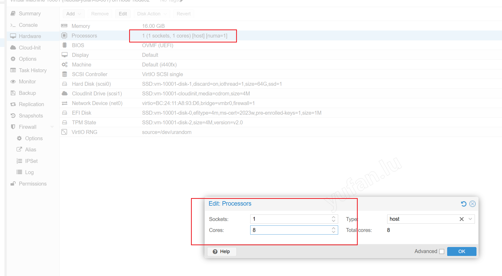

---

### 步骤3：配置网络桥接

#### 3.1 选中网络设备

在硬件列表中找到 **Network Device (net0)** 这一行（虚拟机的第一个网络接口）。

#### 3.2 打开编辑窗口

双击 **Network Device (net0)**，或选中后点击 **Edit** 按钮，弹出 **Edit: Network Device** 对话框。

#### 3.3 修改桥接设置

在对话框中找到 **Bridge** 下拉菜单：

1. 点击下拉菜单，查看可用的网桥列表（如：`IaaS`、`Infra`、`InfraR`、`vmbr0`、`vmbr1` 等）
2. 根据需求选择对应的网桥
   - ⚠️ **务必按照网络规划选择正确的网桥**（如：选择 **Infra**）

#### 3.4 保存配置

确认 **Bridge** 设置正确后，点击 **OK** 按钮保存。

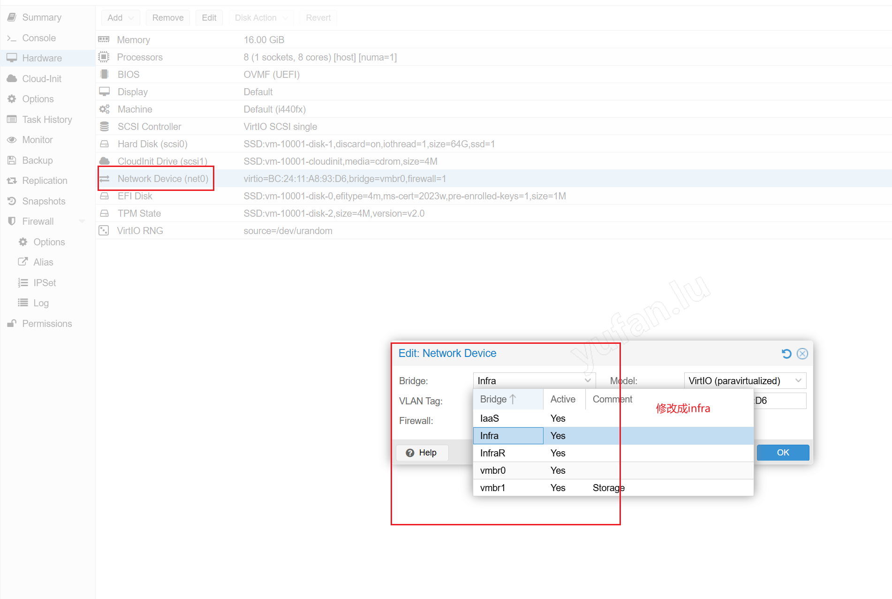

---

## 启动虚拟机

### 步骤1：启动虚拟机

所有配置完成后：

1. 点击左侧菜单的 **Console** 选项
2. 点击上方的 **Start** 按钮启动虚拟机

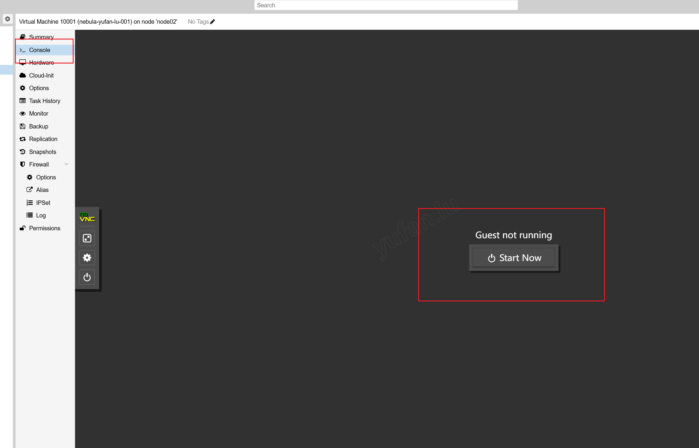

---

### 步骤2：等待虚拟机启动

虚拟机启动过程可能需要几分钟，请耐心等待。当界面出现登录提示时，表示虚拟机已经启动完成。

> 💡 **提示**：你可以看到登录界面，证明系统已成功初始化并运行。

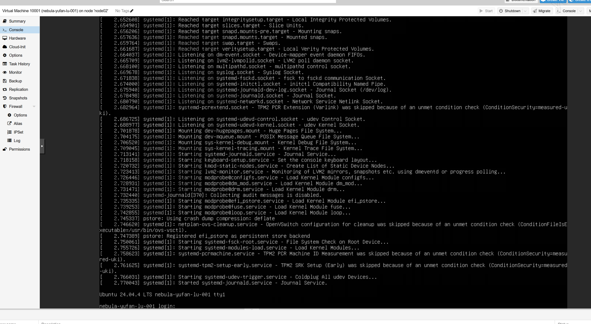

---

### 步骤3：验证网络连通性

在本地PowerShell中测试虚拟机是否可以访问：

```bash
ping <虚拟机IP地址>
# 例如：ping 10.10.110.101
```

如果能够Ping通，说明网络配置正确，可以尝试SSH连接。

---

## VSCode远程连接

### 步骤1：安装Remote - SSH插件

#### 1.1 打开扩展市场

在VSCode左侧点击扩展图标，打开扩展市场。

#### 1.2 搜索插件

在搜索栏中输入关键词：`ssh`

#### 1.3 安装官方插件

在搜索结果中找到由 **Microsoft** 官方发布的 **Remote - SSH** 插件。

- 图标：蓝色方框，内有白色箭头符号
- 描述：`Open any folder on a remote machine using SSH...`

点击 **Install** 按钮进行安装。

> **注意**：安装 **Remote - SSH** 时，会自动安装 **Remote Explorer** 组件，用于管理SSH连接目标。

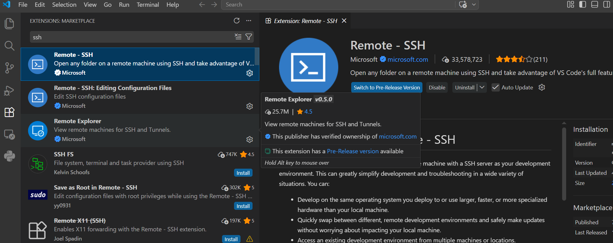

---

### 步骤2：打开远程连接菜单

#### 2.1 访问远程连接入口

在VSCode界面左下角，找到一个 **齿轮形状的设置图标**（通常在用户图标下方）。

#### 2.2 选择连接选项

点击齿轮图标后，在弹出的菜单中点击 **"Connect to Host..."** 选项。

- 此选项右侧会标注 `Remote-SSH`，表示通过SSH协议操作

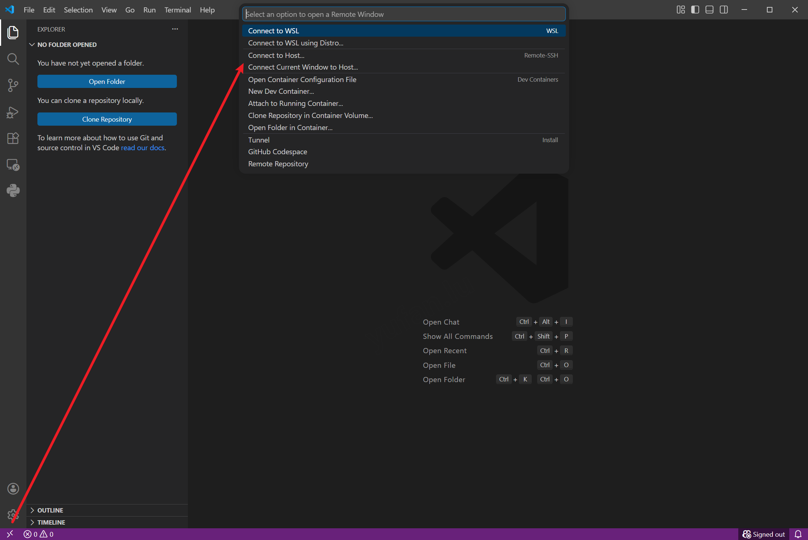

---

### 步骤3：配置SSH主机

#### 3.1 编辑配置文件

在弹出菜单中选择 **Configure SSH Host...**，用于编辑SSH配置文件。

> 💡 **说明**：配置文件路径通常为 `C:\Users\<用户名>\.ssh\config`（Windows）或 `~/.ssh/config`（Linux/Mac）。

#### 3.2 添加主机配置

在配置文件中添加以下内容：

```
Host 展示VM连接
    HostName 10.10.110.101
    Port 22
    User nebuser
    IdentityFile "C:\Users\yufan.lu\.ssh\id_ed25519"
```

**配置说明：**

| 字段 | 说明 | 示例 |
|------|------|------|
| **Host** | 连接别名（方便识别） | `展示VM连接`、`开发服务器` |
| **HostName** | 远程服务器IP地址 | `10.10.110.101` |
| **Port** | SSH端口（默认22） | `22` |
| **User** | 登录用户名 | `nebuser` |
| **IdentityFile** | 私钥文件路径 | `C:\Users\<用户名>\.ssh\id_ed25519` |

> ⚠️ **注意**：请将上述示例中的IP地址、用户名、私钥路径替换为你的实际配置。

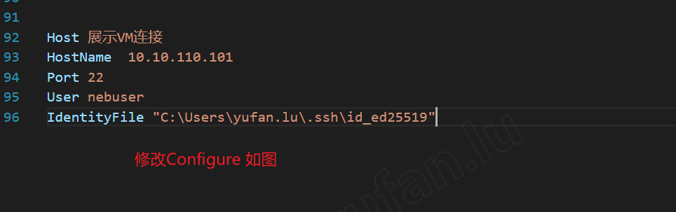

---

### 步骤4：保存配置

修改完成后，保存配置文件（通常按 `Ctrl+S` 或 `Cmd+S`）。

---

### 步骤5：发起连接

#### 5.1 选择已配置的主机

1. 再次点击左下角的齿轮图标
2. 选择 **"Connect to Host..."**
3. 此时已配置的主机会显示在列表中
4. 选择刚才配置的主机别名（如：`展示VM连接`）

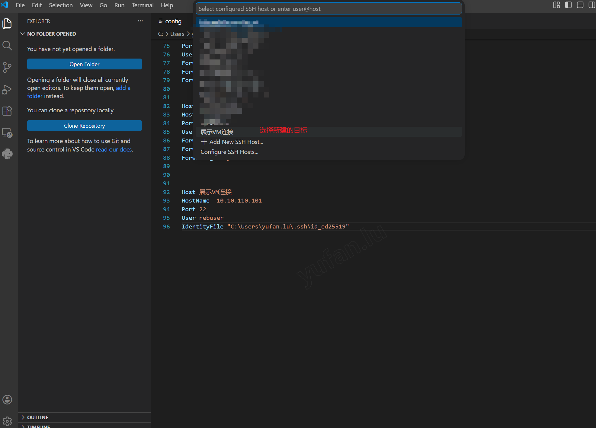

---

### 步骤6：验证SSH连接

#### 6.1 选择操作系统类型

连接时，VSCode会提示选择操作系统类型，选择 **Linux**。

#### 6.2 输入密钥密码

系统会提示输入SSH密钥的密码（即生成密钥时设置的密码）。

> ⚠️ **重要**：此处输入的是SSH密钥的密码，不是虚拟机的用户密码。

#### 6.3 等待环境配置

如果连接正常，VSCode会自动在远程服务器上安装VSCode Server，并配置远程开发环境。这个过程可能需要几分钟时间。

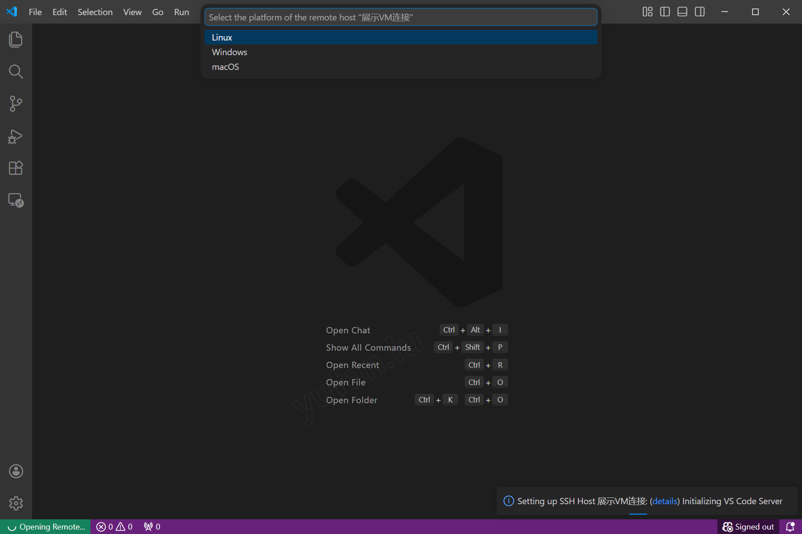

---

### 步骤7：连接成功

连接完成后：

1. VSCode左下角会显示当前连接的主机信息（如：`SSH: 展示VM连接`）
2. 左侧资源管理器会显示远程服务器上的文件系统
3. 你可以像操作本地文件一样操作远程服务器

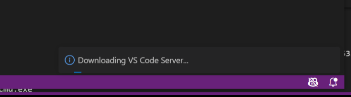

---

### 最终效果

成功连接后，VSCode右下角会显示已连接到远程主机的状态，此时你可以：

- 📁 浏览和编辑远程服务器的文件
- 💻 在远程服务器上运行终端命令
- 🐛 调试远程服务器上的程序
- 📦 安装和管理远程服务器上的扩展

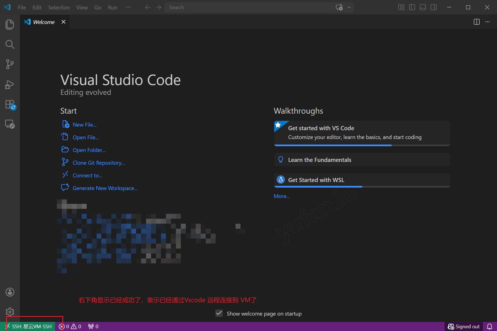

---

## 常见问题排查

### 问题1：SSH连接时提示"Connection refused"

**可能原因：**
- 虚拟机未正确启动
- SSH服务未运行
- 防火墙阻止连接

**解决方法：**
1. 在PVE控制台中检查虚拟机运行状态
2. 使用 `ping` 命令测试网络连通性
3. 使用telnet测试SSH端口(22)是否可访问：
   ```bash
   telnet <虚拟机IP地址> 22
   ```
   > 💡 如果telnet未安装，请参考 [Windows配置Telnet指南](Window配置telnet.md)
4. 检查云防火墙规则是否开放22端口

---

### 问题2：SSH密钥认证失败

**可能原因：**
- 公钥未正确配置到Cloud-Init中
- 私钥文件路径错误
- 密钥密码输入错误

**解决方法：**
1. 先使用telnet测试SSH端口是否可访问：
   ```bash
   telnet <虚拟机IP地址> 22
   ```
   如果能看到SSH版本信息（如 `SSH-2.0-OpenSSH_8.9`），说明网络和SSH服务正常
   > 💡 如果telnet未安装，请参考 [Windows配置Telnet指南](Window配置telnet.md)
2. 确认Cloud-Init中的SSH public key已正确配置
3. 验证本地私钥文件路径是否正确
4. 重新输入密钥密码

---

### 问题3：虚拟机无法获取静态IP

**可能原因：**
- IP地址已被占用
- 网桥配置错误
- Cloud-Init镜像未重新生成

**解决方法：**
1. 在PVE中检查IP地址分配情况
2. 确认Network Device的Bridge设置正确
3. 重新点击"Regenerate Image"按钮

---

**文档版本**：v1.0
**最后更新**：2026年4月10日
**维护者**：星云智联技术团队
